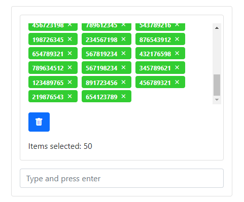

<!-- Improved compatibility of back to top link: See: https://github.com/othneildrew/Best-README-Template/pull/73 -->

<!-- ABOUT THE PROJECT -->
## Input Combo

  

O projeto é basicamente um input que insere os elementos digitados em um card. É possivel inserir um de cada vez ou vários, separando cada elemento por um espaço em branco.

### Ferramentas utilizadas

Toda a parte construção e estilização foi feita com o framework bootstrap.

[![Bootstrap][Bootstrap.com]][Bootstrap-url]

<!-- CONTACT -->
## Contact

Daniel Santos - danielelias3221@gmail.com

<!-- MARKDOWN LINKS & IMAGES -->
<!-- https://www.markdownguide.org/basic-syntax/#reference-style-links -->

[product-screenshot]: img/input-combo.img.png
[Bootstrap.com]: https://img.shields.io/badge/Bootstrap-563D7C?style=for-the-badge&logo=bootstrap&logoColor=white
[Bootstrap-url]: https://getbootstrap.com
